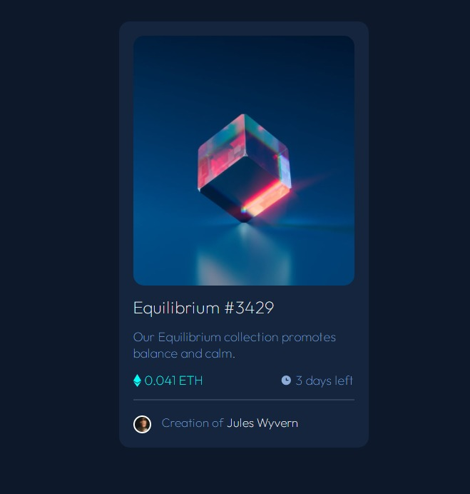

# Frontend Mentor - NFT preview card component solution

This is a solution to the [NFT preview card component challenge on Frontend Mentor](https://www.frontendmentor.io/challenges/nft-preview-card-component-SbdUL_w0U). Frontend Mentor challenges help you improve your coding skills by building realistic projects.

## Table of contents

- [Overview](#overview)
  - [The challenge](#the-challenge)
  - [Screenshot](#screenshot)
  - [Links](#links)
  - [Built with](#built-with)
  - [What I learned](#what-i-learned)
  - [Continued development](#continued-development)
  - [Useful resources](#useful-resources)
- [Author](#author)
- [Acknowledgments](#acknowledgments)

## Overview

### The challenge

Users should be able to:

- View the optimal layout depending on their device's screen size
- See hover states for interactive elements

### Screenshot

**Expected Design**


**Final Output**



### Links

- Live Site URL: [https://rohitkumar38344.github.io/](https://rohitkumar38344.github.io/)

## My process

### Built with

- Semantic HTML5 markup
- CSS
- Flexbox

### What I learned

The usage of background property for positioning background images overlay background color and some of its most
important properties to position images.

```css
.crypto-img:hover:before {
  content: "";
  position: absolute;
  left: 0;
  right: 0;
  top: 0;
  bottom: 0;
  background: center no-repeat url("./images/icon-view.svg") rgb(61 239 232 /
        50%);
  cursor: pointer;
}
```

### Continued development

Just want to make it responsive, after learning responsive design.

### Useful resources

- [stack overflow](https://stackoverflow.com/questions/36679649/how-to-add-a-color-overlay-to-a-background-image) - This helped me for changing bacground-color and overlaying image. It helped me to learn more out background property in css.

## Author

- Frontend Mentor - [@rohitKumar38344](https://www.frontendmentor.io/profile/rohitKumar38344)
- Twitter - [@\_iamrohitKumar](https://twitter.com/_iamrohitKumar)

## Acknowledgments

- [Jonasschmedtman](https://twitter.com/jonasschmedtman) - Big thanks for helping in my journey of learning frontend development.
